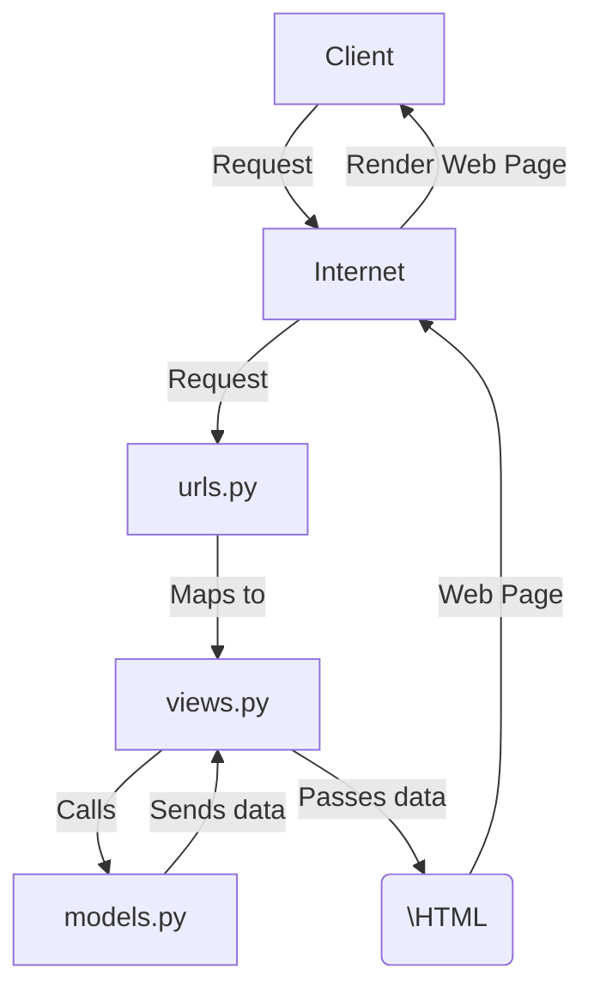

# Valorant Trade
https://kukuh-cikal-valotrade.pbp.cs.ui.ac.id/

## Deployment Steps
1. Creating a new Django Project
    * Make a new directory, in my case called "valo-trade" as the name of my project. Then a command prompt is needed to execute the installation command. The command prompt (CMD) should be opened in the same directory of the projects. To do so, simply run these command in the CMD. However, in case the directory doesnt change after the command, simply run the disk partition name of the directory path (i.e. `D:`).
        ```bash
        cd "YourDirectoryPath"
        ```
    * Make a virtual environment by running command below in CMD
        ```pyton
        python -m venv env
        ```
    * Activate the virtual environment by following command in CMD
        ```bash
        env\Scripts\activate
        ```
    * Install the required dependencies by putting it inside a requirements.txt file, then simply run
        ```bash
        pip install -r requirements.txt
        ```
    * Create the django project by running the command below in CMD. The project is preferably be named after the same project name as the directory before, as in my case will be "valo_trade"
        ```bash
        django-admin startproject valo_trade .
        ```
2. Pushing the project into GitHub & PWS
    * **Giving access.** To make sure the project can be accessed throughout the local & PWS server, we need to add the http or ip address to the `ALLOWED_HOST` variable inside `settings.py`. This variable indicates list of hosts that is allowed to access the web application. As we want the project to be accessed by localhost & PWS, we will add the following inside the `ALLOWED_HOST`:
        ```python
        ...
        ALLOWED_HOSTS = ["localhost", "127.0.0.1", "kukuh-cikal-valotrade.pbp.cs.ui.ac.id"]
        ...
        ```
    * **Pushing to GitHub.** A git tool must be installed to proceed after this step. Documentation of installation & GitHub setup available [here](https://docs.github.com/en/get-started/getting-started-with-git/set-up-git). Before pushing to GitHub, the project must be defined/initiated as a git repository. To do so, by using the previous CMD, run the command `git init`. Then, create a new GitHub repository & connect it with the local repository by running `git remote add origin <URL_REPO>`. The rest is doing `add`, `commit` & `push` by respectively running `git add .`, `git commit -m "<COMMIT_COMMENT>"`, and `git push -u origin main`. 
    
    * **Pushing to Pacil Web Service (PWS).** A git tool is also needed to proceed this step. First thing first, simply create a new project at PWS. It is highly recommended to mark down the credentials provided by PWS. Then, add the deployment URL to the `ALLOWED_HOST` in `settings.py` file by the format of `<username-sso>-<nama proyek>.pbp.cs.ui.ac.id`. In my case, i named the project as valotrade thus making my deployment URL be `kukuh-cikal-valotrade.pbp.cs.ui.ac.id`. After that, run the commands provided by the PWS inside CMD, including:
        ```bash
        git remote add pws https://pbp.cs.ui.ac.id/kukuh.cikal/valotrade
        git branch -M master
        git push pws master
        ```
3. Creating a new app 'main' into the project
    * This django project is using **Model-View-Template (MVT)** with the documentation available [here](https://www.geeksforgeeks.org/django-project-mvt-structure/). MVT is used as it benefits developer to split their work on App Logic, Interface, and Data.
    * **Creating & adding main app.** a new app `main` can easily be created by running the command `python manage.py startapp main`. Then, adding the `main` app to the `INSTALLED_APPS` list in `settings.py` should be most necessary. Inside the `main` app directory , create a new directory named `templates`. Inside it, create a new file named `main.html` filled by desired code.
    * **Modifying & migrating models.** Inside the `main` directory, open the `models.py` and create a new class inheriting `models.Model`, containing the variable & fields required in the main application. Then, each time the models is modified, make a new migration to the local drive by running `python manage.py makemigrations` and `python manage.py migrate` from the CMD.
    * **Integrating the MVT Components.** Inside the `main` directory, open the `vies.py` and create a new function taking the parameter request `show_main(request)`, containing a dictionary `context` with key & value as a data to be used inside the main models.
    * **Configuring the main URL routing.** Inside the `main` directory, create a new file `urls.py` with the code below. Then, add the URL route to the `urls.py` inside project directory, as in my case `valo_trade`.
        ```python
        from django.urls import path
        from main.views import show_main

        app_name = 'main'

        urlpatterns = [
            path('', show_main, name='show_main'),
        ```
    * **Pushing to Github & PWS.** Do git add, commit, and push to GitHub & pws.

## Django Webservice Diagram

When a user is accessing a website, the `client`, usually a web browser, sends a request to the `internet`. This request first passes throught internet, then directed throught Django's routing managed by `urls.py`. `urls.py` is responsible for mapping the request URL to the appropriate function or classe in `views.py`. Once the request is routed to a view, Django’s view logic `view.py` takes over, calling a function in `models.py` to interact with the database. Then, the data is send back and rendered by Template `\HTML`. This HTML content is then sent through the internet again back to the client and displayed by the web page renderer.

## Additional Informations
### Git
This project is developed using git, a software development tool used to track and manage change in the codes, making it easier to revert to previous versions when needed. It also neables collaboration by allowing multiple developers to work on seperate branches and merge their changes into the main project without conflicts. With tools for conflict resolution, Git ensures code integrity while improving the overal efficiency of the development process. The distributed nature of git allows developer to work locally and push changes to online repositories like GitHub.
### Django
Django is considered beginner-friendly because it simplifies web development by providing a high-level, all-in-one framework with built-in tools for common tasks, such as authentication, database management, and URL routing. Beginners may also focus more on building features rather than setting up configurations in Django. Django also follows the Model-View-Template (MVT) architecture, which helps in organizing code efficiently, and has extensive documentation and a supportive community, making it easier for newcomers to learn and develop projects quickly.

### ORM in Django
Django models are called Object-Relationa Mapping (ORM) since they allow developers interact with databases without writing SQL, using python. This happens because ORM automatically translate Python code into SQL, making the database management easier for beginner and more intuitive.

## Changelog Tugas 3
### FAQ
1. **Why do we need data delivery in implementing a platform?** Data delivery allows the smooth theraction between frontend and backend. It's possible because it enables applications to process user inputs, exchange information between systems, and display contents dynamically. XML and JSON are some of the most commonly used formats for data delivery due to their simplicity and readability.

2. **Which is better: XML or JSON? Why is JSON more popular?** Most of the time, JSON is considered better for modern applications due to its lightweight nature and easier parsing method. Compared to XML which uses tags that may increase data size, JSON also has a simpler syntax. The format of JSON that closely resembles how data is represented in `JavaScript` also making it a popular choice among web and mobile development.

3. **The use of is_valid() method in Django forms.** The method `is_valid` is used to check if the data submitted through the form fit the form's field specified rules. This rules include checking required fields, field types, and other validation such as min/max values. `is_valid` became a essential process to check since it ensures that only valid data is processed and saved to the database, preventing data corruption and errors.

4. **Why do we need a csrf_token in Django forms?** The `csrf_token` is important to prevent Cross-Site Request Forgery (CSRF) attacks. The attack involes tricking the users into making unauthorized or unintended request that endanger their data within the application. Adding `csrf_token` ensures that the form request is coming from trusted source, which is authenticated user, not from outside attacker.

### Implementation Steps
1. **Set up the project skeleton.** To ensure the layout consistency across all views, a `base.html` template should be created.

2. **Create Django form and views.** A `ModelForm` should be created to handle form creation automatically based on the model fields. `ModelForm` reduces the need to manually define each input field in HTML code. Then, Django views is created to handle data inputs and render the forms.

3. **Handling Data Subimssion.** The data submitted by the form should be validated by `is_valid()` method, ensuring no corrupt data enters the database. CSRF protectionn should also be added, ensuring safe form submission from CSRF attack.

4. **Searilize data for APIs.** Using `serializers` to convert the query data from databse into a more readable format like XML and JSON. This enable the platform to serve data as an API.

### Postman Requests
1. **XML**

2. **JSON**

3. **XML by ID**

4. **JSON by ID**


## Changelog Tugas 4
### FAQ
1. **What's the difference between HttpResponseRedirect() and redirect?** `HttpResponseRedirect()` is a class in Django that used to explicitly send HTTP respond with a status code of `302`, indicating the website to directing the website indo a new URL. The weakness `HttpResponseRedirect()` is that the URL has to be provided manually, making it inpractice in managing many URLs. On the other hand, `redirect()` enable the user to pass not only URL, but also `View Names`, `Model Objects`, and `URL resolvers` which is defined by the function reverse().

2. **How's the connection between the Product model and the User working?** In this context, `User` may create multiple `Product` entries. By applying database modelling, we may connect `Product` and `User` by using Django `ForeignKey`, making each instance of `Product` connected exactly one `User`. Thus, inside the `Product` class, there should be a variable `user` assigned with `models.ForeignKey()`.

3. **What is the difference between authentication and authorization, and what happens when a user logs in?** 
    * **Difference between authentication and authorization**: `Authentication` is a process to verify a User identity. The authentication process usually involve checking credential informations such as username and password. On the other hand, `Authorization` define the which resources of the platform the User is allowed to access.

    * **What Happend When the User Logged In?** Django use `AuthenticationForm` to capture the login credentials which the user send using POST request. The credentials is then being verified using `authenticate()` function, to which if the credentils is valid, a Django `session ID` is created using the function `login()`. This session is also stored in cookies, enabling the website to maintain login status of the user. In the last step, the function `redirect()` is called to direct the user back to the main page.

4. **How does Django remember logged-in users? Wha's the use of cookies and do all cookies are safe to use?** When a User logged in, Django create a session which store `session ID` to the server and also send it to the user's browser in a form of `cookie`. By using this cookie, every time User send a request to the server, the `session ID` will be used to identify the User instead of giving the credentials all the time. Besides storing session ID, cookies may also store `csrftoken` which is used to prevent the Cross-Site Request Forgery (CSRF) attack. It has to be noted that not all cookies are safe. A cookies which store sensitive information such as login informations have to be `encrypted` so that it can only be accessed by server.

### Implementation Steps
1. **Implementing the Register, Login, and Logout functions.** A register form is created by importing `UserCreationForm` class. Then, a login form may be created by using `AuthenticationForm`. Lastly, logout button can be simply created by deleting the current session.
2. **Connecting Product model with User.** In the model `Product`, a ForeignKey is added to the model of `User` so that each product entry has a relation to the user who created it.
3. **Showing LoggedIn User Informations.** `last_login` varibale which is taken from the cookies is added to the `main.html`. By doing so and adding other information, the current logged in user and its last login time can be displayed in the website.
 
## Changelog Tugas 5
### FAQ
1. **What is the priority order of multiple CSS selector?** If multiple `CSS selector` is applied to a certain HTML element, the CSS would prioritize the selector from its specification. These are the priority:
    * **Inline styles**: Style which are written direcly in the HTML element would have the highest priority. This includes using inine CSS with `Tailwind` classes.
    * **ID selectors**: Id selector has to be unique because each HTML element may only has  one `Id`, and each `Id` may only be applied to one element.
    * **Class selectors**: This selector targets HTML element using its class attribute. Unlike id selectors, class selectors can be used multiple times on many elements.
    * **Element selectors**: This selector targets HTML element using its element tag (i.e. `<p></p>`, `<div></div>`, and `<h1></h1>`).

2. **Why is responsive web design important?** The devices used to access website such as desktop, tablet, and smartphone wont have the same screen size. Implementing responsive web design is necessary to ensure a good `user experience` and across this different platforms. Responsive web design includes automatic layout adjustment, hiding collapsing elements, and others. By doing so, user may have the best experience thus increasing the rank of the website in the SEO. An example of good responsive web design is `twitter/X` with its consistent and seamless functionality in both desktop and mobile version. In the other hand, a bad example of website which doesnt implement responsive web design is `SiakNG`, featuring no different design for mobile users which make them hard to use (peace ✌️🕊️).

3. **What is the difference between margin, border, and padding?** In CSS, margin, border, and padding is a part of `box model` which control the layout of a web design. Each of this component has its own function to arrange the space around the elements.
    * **Margin**: An empty space around the element which seperate the element with its surrounding. Margin doesnt have color or any other visual properties.
    * **Border**: A line which surround the element and located between padding and margin. Border may have color, stroke size, and styles (i.e. solid, dashed, or dotted). Border may give a clear visual boundary between the element and its surrounding.
    * **Padding**: A space inside the element, located between content and border. Padding make sure that a content wont stick directly to its border. Like margin, padding doesnt have color or any other visual properties.<br>
    

4. **What does the flex box and grid layout do?** Flexbox and Grid layout are two fo CSS layouting system which designed to assits developer to arrange element flexibly and efficiently. `Flexbox (Flexible Box)` function as a way to arrange element in `one dimention` each time, horizontally or verticaly. Flexbox is ideal to arrange elements which have to be distributed in a direction such as navbar or arranging horizontal box with consistent space between the elements. `Grid Layout` in the other hand enables the user to arrange elements in `two dimention` simultaneously. For example, a columns and rows may be defined to arrange how much elements can fit into a grid.

### Implementation Steps
1. **Configuring Static Files.** The code setting in `settings.py` has to be adjusted so that the project may access static files such as CSS, images, and fonts.
2. **Setting up Tailwind.** The CDN tailwind `<script src="https://cdn.tailwindcss.com"></script>` is added to the `base.html` file so that every page may access it.
3. **Page Styling.** Tailwind CSS is used to style the web design, including login, register, and main page. Responsive web design has also to be accounted, making sure each design fits perfectly with any screen size. This is done by setting up specific screen size settings using syntax like `sm:` or `md:`.
4. **Testing.** After completing the CSS styling, everything is feature is being check with every screen size and platforms so that it makes sure the design quality and responsiveness of the website project.

# Contributing
Pull requests are welcome. For major changes or bug reports, especially from `asdos` or `friends`, please open an issue first
to discuss what you would like to change. Cheers -Kukuh